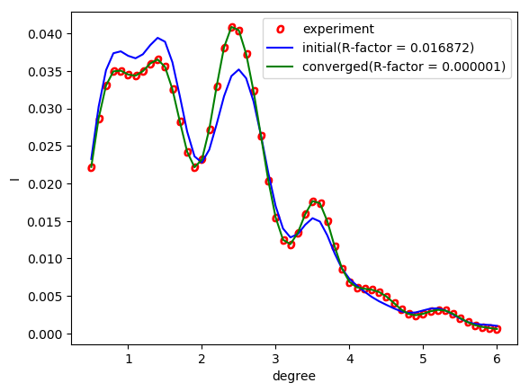

``minsearch`` を用いた解析
====================================

ここでは、Nealder-Mead法を用いて回折データから原子座標を解析する
逆問題の計算を行います。

計算実行
~~~~~~~~~~~~

逆問題を実行するためのPythonスクリプトminsearch.pyを
フォルダtest-minsearchに移動し、ここに
Fortranの実行ファイル(bulk.exe, surf.exe)、
Siの結晶データ(Si001b.txt)をコピーします。
結晶データの名前はbulk.txtとします。

ここでは、前章で作成したconvolution.txtを疑似的な実験データとみなし、
experiment.txtとしてコピーしたものを用います。
これは、sampleフォルダにあります。
理論データsurf-bulkP.sをもとにつくられたデータなので、
これを実験データとみなして最適化を行えば、
求まる解は前章で用いたsurf.txt（Si2x1.txt）にある数値と厳密に同じになります。

また、同フォルダには、surf.txt（Si2x1.txt）を以下のように編集したファイルが、
template1.txtとして用意されています。surf.txt（Si2x1.txt）の中で、
動かすパラメータ（求めたい原子座標などの値）を「value_*」などの適当な文字列に
書き換えたものです。　

.. code-block:: none

   2      ,NELMS,  -------- Si(001)-2x1
   14,1.0,0.1     ,Si Z,da1,sap
   0.6,0.6,0.6     ,BH(I),BK(I),BZ(I)
   14,1.0,0.1     , Si Z,da1,sap
   0.4,0.4,0.4     ,BH(I),BK(I),BZ(I)
   6, 2,0,0,1, 1.7, -0.5,0.5          ,NSGS,msa,msb,nsa,nsb,dthick,DXS,DYS
   6      ,NATM
   1, 1, 0.3176, 0  ,value_01    ,IELM(I),ocr(I),X(I),Y(I),Z(I)
   2, 1, 0.4689, 0.5,value_02
   2, 1, 1  , 0.5,    2.15579
   2, 1, 0  , 0.5,    1.90049
   2, 1, 1  , 0  ,    0.74396
   2, 1, 0  , 0  ,    0.59726
   1,1           ,(WDOM,I=1,NDOM)

ここでは、2つのSi原子のz座標の値、4.62644と3.40471を求めることにします。
まず、実行用フォルダを作成し、以下のファイルを配置します。

- minsearch.py (プログラム本体)
- bulk.exe (バルク計算プログラム)
- surf.exe (表面計算プログラム)
- bulk.txt （バルク入力ファイル.Si001b.txtのファイル名を変更したもの）
- template.txt (表面入力ファイルsurf.txtのもととなるテンプレート。sampleのtemplate1.txtをコピーして用いる。)
- experiment.txt (reference のrocking curve data．本来は実験データ．今は人工データ)

以下のようなフォルダ構造になるように配置して下さい。
ここで、test-minsearchの名前、場所は任意です。

.. code-block:: none

   test-minsearch（任意のフォルダ名）
   ┣ bulk.exe
   ┣ surf.exe
   ┣ minsearch.py
   ┣ bulk.txt
   ┣ template.txt
   ┗ experiment.txt

上記をコマンドで実行するには、例えば以下のようにします。

.. code-block:: none

   cd C:\Users\user\Documents\surface_analysis_tool
   mkdir test-minsearch
   cd test-minsearch
   copy ..\source\bulk.exe .
   copy ..\source\surf.exe .
   copy ..\scripts\minsearch.py .
   copy ..\sample\Si001b.txt bulk.txt
   copy ..\sample\template1.txt template.txt
   copy ..\sample\experiment.txt experiment.txt

minsearch.pyは局所探索アルゴリズムNelder-Mead法を用いて、
初期値として与えられた値の周りで解を探索します。
今の場合、value_01が4.62644、value_02が3.40471のsurf.txt（Si2x1.txt）を
入力データにしたsurf-bulkp.sをもとに疑似的な実験データを使っているので、
求まる解は4.62644と3.40471のはずです。
したがって、初期値（initial guess）としてそれらに近い値である4.5と3.5を設定します。

以下のように、minsearch.pyを実行します。

.. code-block:: none

   python ./minsearch.py --dimension 2 --llist "z1(Si)" "z2(Si)" --slist "value_01" "value_02" --inilist 4.5 3.5 --minlist -10.0 -10.0 --maxlist 10.0 10.0 --efirst 1 --elast 56 --cfirst 5 --clast 60

ここで、

- --dimension 2で、動かす原子座標（求める原子座標）が2つであること
- --llist "z1(Si)" "z2(Si)"で、それらの原子座標を"z1(Si)"と"z2(Si)"と名付けること
- --slist "value_01" "value_02"で、それらの原子座標に対応するtemplate.txt中の文字列が"value_01"と"value_02"であること
- inilist 4.5 3.5で、初期値（initial guess）として、4.5と3.5という値から最適化をはじめること
- --minlist -10.0 -10.0、--maxlist 10.0 10.0で、原子座標の値が-10から10までの範囲に収まるように最適化を行うこと
- --efirst 1、--elast 56で、実験データの読み込む範囲（この場合1行目から56行目まで読み込みます）
- --cfirst 5、--clast 60で、計算データの読み込む範囲（この場合5行目から60行目まで読み込みます）

を設定しています。（次章、もしくはマニュアルでも説明しています。）
上記の設定は、解析の条件に合わせて毎回変える必要があります。

実行すると、以下のような出力が得られます。

.. code-block:: none

   Read experiment.txt
   Perform bulk-calculation
   （中略）
   Optimization terminated successfully.
   Current function value: 1.3325422753776586e-06
   Iterations: 31
   Function evaluations: 59
   Solution:
   z1(Si) = 4.626441878249409
   z2(Si) = 3.404705315811605

59回R-factorの計算が行われ、31回のiterationで、
z1(Si) = 4.626441878249409, 
z2(Si) = 3.404705315811605 
という解が求まりました。

計算結果の可視化
~~~~~~~~~~~~~~~~~
31回のiterationそれぞれにおけるロッキングカーブのデータが、
Extra_Log00000001からExtra_Log00000031に保存されています。
Extra_Log00000001にあるRockingCurve.txtをRockingCurve_ini.txt、
Extra_Log00000031にあるRockingCurve.txtをRockingCurve_con.txtとして準備し、
draw_RC_double.pyを実行します。

.. code-block:: none

    copy Extra_Log00000001\RockingCurve.txt RockingCurve_ini.txt
    copy Extra_Log00000031\RockingCurve.txt RockingCurve_con.txt
    copy ..\scripts\draw_RC_double.py .
    python draw_RC_double.py

実行すると、以下のようなグラフRC_double.pngが得られます。

initialとして青で示したグラフが、原子座標が初期値（4.5と3.5）のロッキングカーブになります。
convergedとして緑で示したグラフが、原子座標が収束後の値
（4.626441878249409と3.404705315811605）のロッキングカーブになります。
このように、最適化が行われる前と後で、ロッキングカーブが
どの程度変化したかをグラフで見ることができます。

また、draw_RC_single.pyを用いて、1つのロッキングカーブを
グラフ化することもできます。

.. code-block:: none

   copy Extra_Log00000031\RockingCurve.txt .
   copy ..\scripts\draw_RC_single.py .
   python draw_RC_single.py

上記実行により、ロッキングカーブがRC_single.pngに出力されます。

.. figure:: ../img/RC_single1.png

